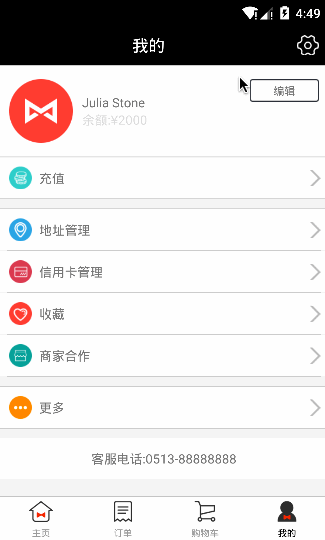
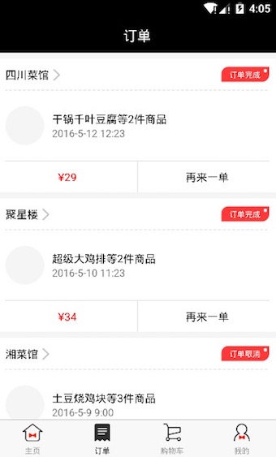
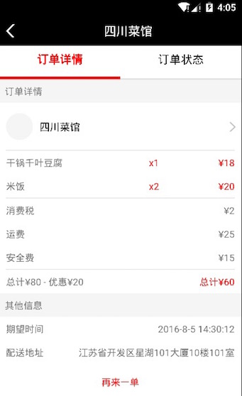
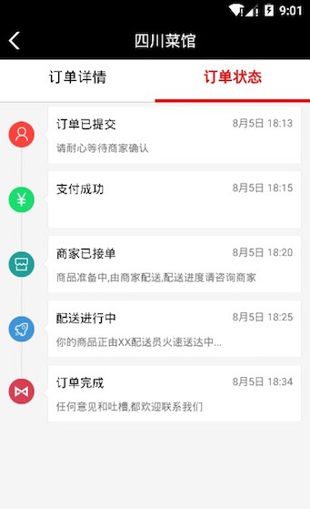
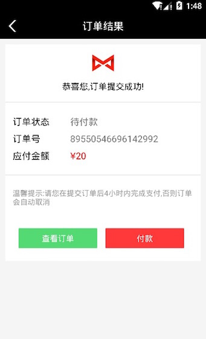
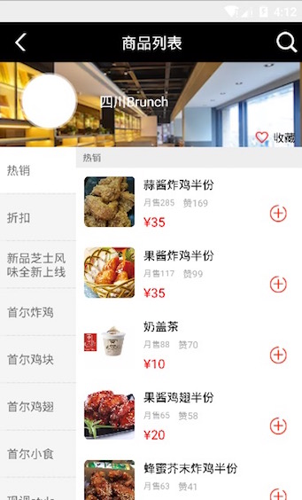

# GaGaMall
React Native开发嘎嘎商城客户端-来自[江清清的技术专栏](http://www.lcode.org)</br></br>
基于React Native 实现的嘎嘎商城客户端，暂时只是适配Android版本，暂时大部分布局页面正在开发中，业务逻辑功能以及iOS版本适配会后面进行。</br>

当前的商城客户端会继续开发商品点单，订单，购物车，支付，商品列表以及详情，搜索功能，定位切换，国际化多语言切换，第三方账号登录以及分享等相关功能。也欢迎广大开发者多提建议。项目继续更新中。

关注我的订阅号(codedev123),每天推送分享移动开发技术(Android/iOS),React Native技术文章,项目管理,程序猿日常点滴以及精品技术资讯文章(欢迎关注,精彩第一时间推送)。</br>
 </br>

####一.依赖组件
###### [1.rn-viewpager](https://github.com/zbtang/React-Native-ViewPager)
###### [2.react-native-tab-navigator](https://github.com/exponentjs/react-native-tab-navigator)
###### [3.leancloud-storage](https://leancloud.cn/docs/)
###### [4.react-native-storage](https://github.com/sunnylqm/react-native-storage)
###### [5.react-native-parallax-scroll-view](https://github.com/jaysoo/react-native-parallax-scroll-view)
###### [6.react-native-wechat](https://github.com/weflex/react-native-wechat)
###### [7.react-native-root-toast](https://github.com/magicismight/react-native-root-toast)
###### [8.react-native-scrollable-tab-view](https://github.com/skv-headless/react-native-scrollable-tab-view)


####二.安装配置
#####1.第一步
```
git clone https://github.com/jiangqqlmj/GaGaMall.git
```
#####2.第二步
```
cd GaGaMall
```
#####3.第三步
```
npm install
```
#####4.第四步
```
1.运行Android版本
Mac OS X:react-native run-android  or Windows OS:react-native start and react-native run-android
2.运行iOS版本
Mac OS X:react-native run-ios or  xcode open project and run project
```
####三.套餐教程
[1.[RN实战-嘎嘎商城]之仿快递时间轴布局实现(订单状态)](http://www.lcode.org/?p=1855)</br>
[2.[RN实战-嘎嘎商城]之轻松实现Tab底部菜单导航栏切换效果-Android/iOS双适配](http://www.lcode.org/?p=1857)</br>
[3.[RN实战-嘎嘎商城]之商家详情界面布局分析与实现](http://www.lcode.org/?p=1865)</br>

####四.运行效果
#####整体效果
 
 
 
 
 
 
 
 
 

####五.打包方法
#####1.Android版本
```
1.签名key以及release签名信息已配置
2.cd GaGaMall
3.cd android && ./gradlew assembleRelease
4.上述命令执行完毕,在android/app/build/outputs/apk目录下面生成app-release.apk
```

####六.安装包下载
#####[1.Android版本](./apks/app-release.apk)
